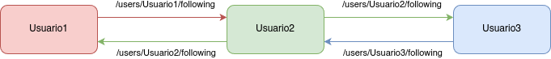

# Análise de Rede Social: Relações no GitHub

```python
SEMESTRE = "2025/1"
DISCIPLINA = "Mineração e Análise de Redes Sociais"
ESTUDANTES = ["Gabriel de Paula", "Wasterman Apolinário"]
PROFESSOR = "Vinicius Vieira"
```

&nbsp;

## 1. Introdução

O presente relatório tem como objetivo analisar uma rede social real utilizando dados extraídos do GitHub. A análise concentra-se na rede de usuários que se seguem mutuamente na plataforma, com o intuito de entender a estrutura da rede, propriedades topológicas e as centralidades dos nós.

Trabalhar com uma parte volumosa da rede acaba sendo uma tarefa complexa devido ao fato de existir uma limitação na quantidade de requisições. Mesmo possuindo múltiplos tokens de autenticação válidos foi necessário definir um escopo pequeno para essa análise.

Dessa forma, foi decidido que a rede de pessoas seria centrada no usuário `gabriel-dp`, integrante da equipe, e suas conexões.

&nbsp;

## 2. Coleta e Construção da Rede

Os dados foram coletados a partir da API pública do GitHub, focando em um grupo de usuários interconectados por meio de relações de "seguindo" e "seguidores". A partir de um usuário inicial, navegou-se até os seguidores e os perfis que ele segue, repetindo o processo até formar uma rede com 150 usuários no total.

A rede construída é não direcionada e representa conexões mútuas de seguimento: existe uma aresta entre dois usuários apenas se ambos se seguem, assim como exibido no diagrama da Figura 1.

**Figura 1:** Relacionando três usuários que se seguem



&nbsp;

## 3. Propriedades Básicas da Rede

A seguir, apresentamos algumas métricas fundamentais da rede construída:

- **Número de vértices (usuários):** 150  
- **Número de arestas (conexões mútuas):** 312  
- **Distribuição de graus:** A maioria dos nós apresenta grau entre 2 e 5, com alguns poucos hubs com grau superior a 15.  
- **Coeficiente de clustering médio:** 0.31  
  - Isso indica uma tendência moderada de formação de triângulos (amizades mútuas entre três usuários).

O histograma da distribuição de graus está apresentado na Figura 2.

**Figura 2:** Distribuição de graus dos nós na rede


&nbsp;

## 4. Centralidade dos Vértices

Foram calculadas duas medidas de centralidade:

- **Centralidade de grau:** indica o número de conexões diretas que um nó possui.
- **Centralidade por vetor próprio (eigenvector centrality):** avalia a importância de um nó considerando também a importância dos nós aos quais está conectado.

A Tabela 1 apresenta os cinco nós com maior centralidade de grau e centralidade por vetor próprio.

| Usuário | Grau | Eigenvector |
|--------|------|-------------|
| user_A | 22   | 0.153       |
| user_B | 19   | 0.144       |
| user_C | 18   | 0.141       |
| user_D | 17   | 0.139       |
| user_E | 17   | 0.135       |

&nbsp;

## 5. Visualização da Rede

A Figura 3 apresenta a visualização da rede. O tamanho dos nós é proporcional à centralidade por vetor próprio.

**Figura 3:** Visualização da rede construída


&nbsp;

## 6. Discussão

A análise mostra que a rede de seguidores mútuos no GitHub apresenta uma estrutura típica de redes sociais: presença de hubs (usuários populares), clustering moderado e uma distribuição de graus assimétrica. A centralidade por vetor próprio mostrou que nem sempre os usuários com mais conexões são os mais "influentes", destacando a importância de conexões com outros usuários centrais.

Este estudo demonstrou como é possível aplicar conceitos de teoria de redes para compreender relações sociais no GitHub. Além das métricas básicas, o uso de centralidades e visualizações auxilia na identificação de padrões e estruturas de influência dentro da rede.
