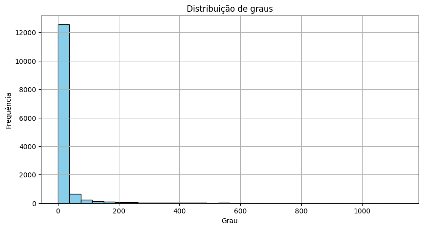
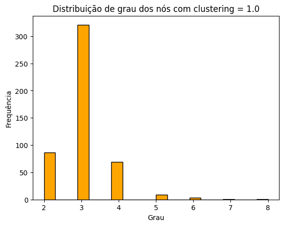
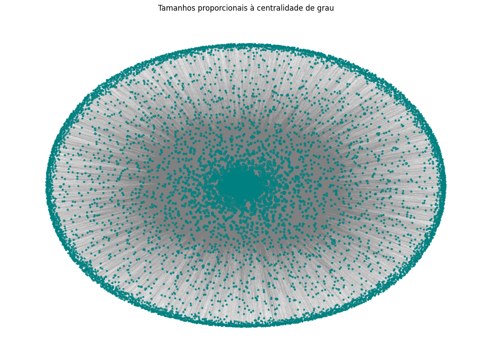
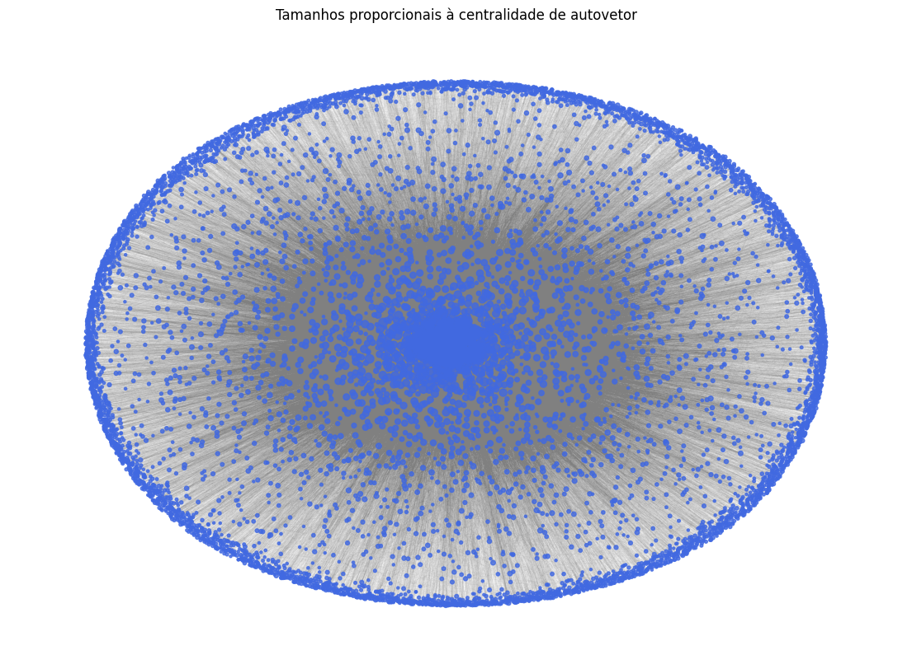
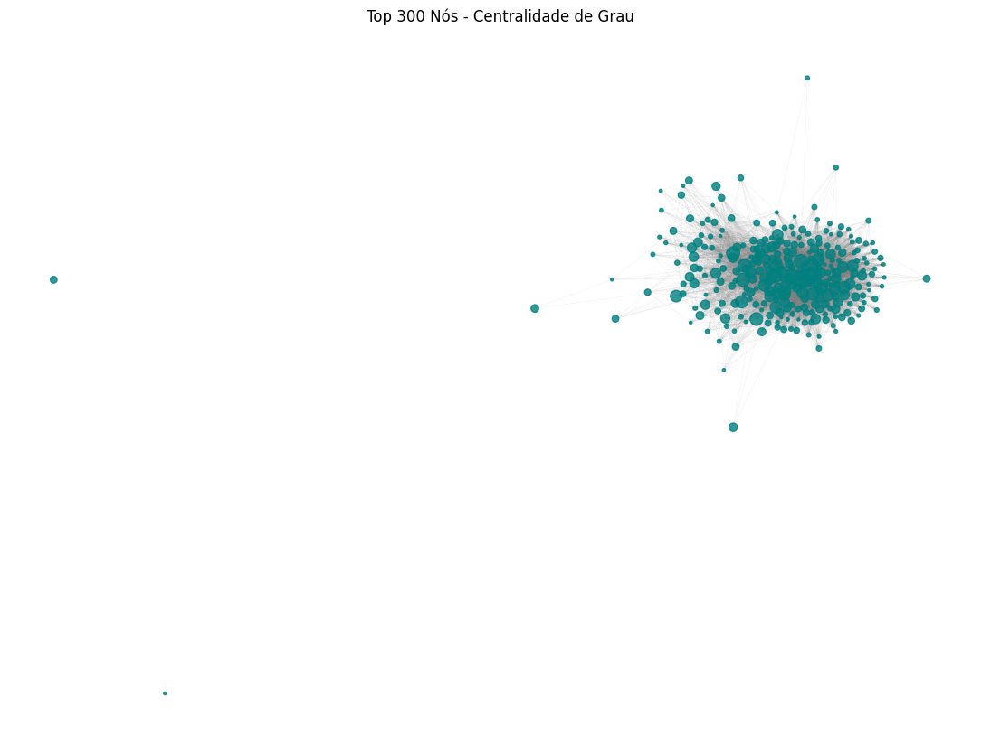
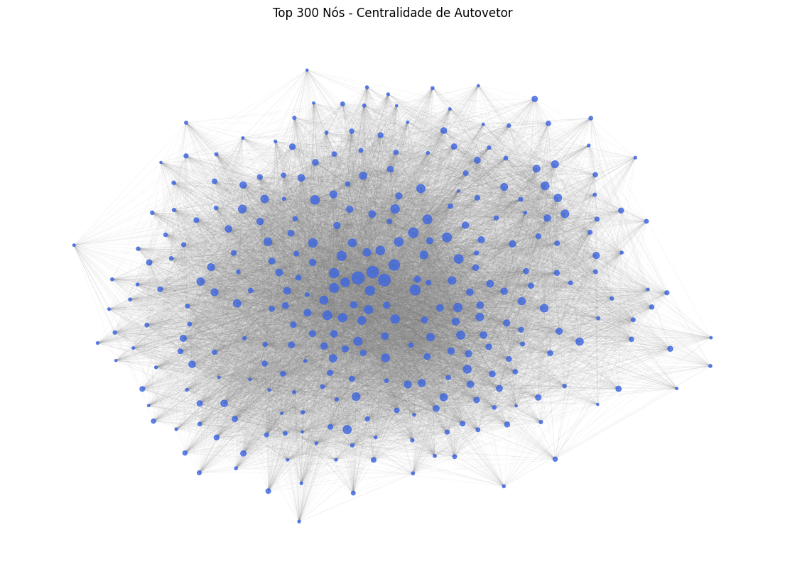

# Análise de Rede Social: Relações no GitHub

```python
SEMESTRE  =  "2025/1"
DISCIPLINA  =  "Mineração e Análise de Redes Sociais"
ESTUDANTES  = ["Gabriel de Paula", "Wasterman Apolinário"]
PROFESSOR  =  "Vinicius Vieira"
```

&nbsp;

## 1. Introdução

O presente relatório tem como objetivo analisar uma rede social real utilizando dados extraídos do GitHub. A análise concentra-se na rede de usuários que se seguem mutuamente na plataforma, com o intuito de entender a estrutura da rede, propriedades topológicas e as centralidades dos nós.

Trabalhar com uma parte volumosa da rede acaba sendo uma tarefa complexa devido ao fato de existir uma limitação na quantidade de requisições. Mesmo possuindo múltiplos tokens de autenticação válidos foi necessário definir um escopo pequeno para essa análise.

Dessa forma, foi decidido que a rede de pessoas seria centrada no usuário `gabriel-dp`, integrante da equipe, e suas conexões.

&nbsp;

## 2. Coleta e Construção da Rede

Os dados foram coletados a partir da API pública do GitHub, com foco em usuários interconectados por relações de “seguindo” e “seguidores”. A partir de um usuário inicial, a coleta foi expandida até a terceira camada da rede, ou seja, foram incluídos seus seguidores e seguidos (1ª camada), os seguidores e seguidos desses usuários (2ª camada), e, por fim, os usuários conectados à segunda camada (3ª camada). Esse processo, somado a algumas podas, resultou na construção de uma rede com aproximadamente **14.000 usuários**.

A rede construída é não direcionada e representa conexões mútuas de seguimento: existe uma aresta entre dois usuários apenas se ambos se seguem, assim como exibido no diagrama da Figura 1.

**Figura 1:** Relacionando três usuários que se seguem


&nbsp;

&nbsp;

&nbsp;

&nbsp;

## 3. Propriedades Básicas da Rede

A seguir, apresentamos algumas métricas fundamentais da rede construída:

- **Número de vértices (usuários):** 13941

- **Número de arestas (conexões mútuas):** 147049

- **Distribuição de graus:** A maioria dos nós apresenta grau entre 1 e 15, com alguns hubs com grau superior a 30, como demonstrado na Figura 2.

&nbsp;

**Figura 2:** Distribuição de graus dos nós na rede



- **Coeficiente de clustering médio:** 0.225

A análise dos coeficientes de clustering revela que, embora o valor médio seja 0.225, há uma concentração notável de nós com coeficiente igual a 1.0 — representando aproximadamente 3,5% do total. No entanto, conforme ilustrado na Figura 2, que apresenta a distribuição dos graus desses nós, observa-se que a maioria possui grau relativamente baixo. Isso sugere que esses nós participam, majoritariamente, de **pequenas estruturas triangulares**, ao invés de grandes comunidades densamente conectadas.

&nbsp;

&nbsp;

&nbsp;

&nbsp;

&nbsp;

**Figura 3:** Distribuição de graus entre os nós com coeficiente de clustering 1.0



## 4. Centralidade dos Vértices

Foram calculadas duas medidas de centralidade:

- **Centralidade de grau:** indica o número de conexões diretas que um nó possui.

- **Centralidade por vetor próprio (eigenvector centrality):** avalia a importância de um nó considerando também a importância dos nós aos quais está conectado.

A Tabela 1 apresenta os cinco nós com maior centralidade de grau, enquanto a Tabela 2 exibe os cinco nós com maior centralidade calculada com base no **vetor próprio**.

**Tabela 1:** Cinco nós com maior centralidade de grau

| Usuário | Grau |
|--------|------|
| **JohnMwendwa** | 0.0203 |
| **Thizh** | 0.0172 |
| befoulers | 0.0164 |
| mxmnk | 0.0163 |
| jfullstackdev | 0.0163 |

&nbsp;

**Tabela 2:** Cinco nós com maior centralidade por vetor próprio

| Usuário | Eigenvector |
|--------|-------------|
| **JohnMwendwa** | 0.1186 |
| kenjinote | 0.1130 |
| IDouble | 0.1093 |
| **Thizh** | 0.0961 |
| gamemann | 0.0885 |

As tabelas de centralidade de grau e centralidade por vetor próprio revelam diferentes aspectos da importância dos nós na rede.

- **Tabela 1 (Grau)**: Reflete o número de conexões diretas de cada nó. Nessa métrica, todos os nós da tabela possuem muitas conexões diretas, independentemente da importância dos seus vizinhos.

- **Tabela 2 (Vetor Próprio)**: Considera a importância dos vizinhos do nó. Aqui, apenas 2 usuários aparecem em ambas as tabelas, indicando que a centralidade por vetor próprio foca mais na qualidade das conexões, enquanto a centralidade de grau apenas conta as conexões diretas, sem levar em conta o impacto dos vizinhos.

&nbsp;

## 5. Visualização da Rede

As Figuras 4 e 5 apresentam a visualização da rede, com o tamanho dos nós proporcional à centralidade por grau e vetor próprio, respectivamente. Devido ao tamanho da rede, foram aplicadas podas nos nós de baixo grau (com grau inferior a 5) com o objetivo de melhorar tanto a performance quanto a legibilidade da visualização.

&nbsp;

&nbsp;

&nbsp;

&nbsp;

&nbsp;

&nbsp;

&nbsp;

&nbsp;

&nbsp;

&nbsp;

&nbsp;

**Figura 4:** Visualização da rede construída utilizando grau para proporção entre nós



&nbsp;

&nbsp;

&nbsp;

&nbsp;

&nbsp;

&nbsp;

&nbsp;

&nbsp;

&nbsp;

&nbsp;

&nbsp;

&nbsp;

&nbsp;

**Figura 5:** Visualização da rede construída utilizando eigenvector para proporção entre nós



&nbsp;

&nbsp;

&nbsp;

&nbsp;

&nbsp;

&nbsp;

&nbsp;

&nbsp;

&nbsp;

&nbsp;

&nbsp;

&nbsp;

&nbsp;

Já as Figuras 6 e 7 destacam os subgrafos formados pelos 300 nós com maior centralidade de grau e centralidade por vetor próprio, respectivamente.

**Figura 6:** Subgrafo com os 300 nós de maior centralidade de grau



&nbsp;

&nbsp;

&nbsp;

&nbsp;

&nbsp;

&nbsp;

&nbsp;

&nbsp;

&nbsp;

&nbsp;

&nbsp;

**Figura 7:** Subgrafo com os 300 nós de maior centralidade por vetor próprio



Observa-se que os nós com maior centralidade por vetor próprio formam uma estrutura mais coesa, com um número significativo de conexões entre si, indicando que esses usuários ocupam posições estratégicas em comunidades densamente interconectadas.

Por outro lado, o subgrafo formado pelos nós com maior centralidade de grau apresenta uma conectividade visivelmente menor. Há até mesmo casos de nós isolados, ou seja, com grau alto em relação ao grafo completo, mas sem conexões com outros nós de alto grau, sugerindo que estão ligados principalmente a nós periféricos e não a outros usuários influentes na rede.

Esse contraste evidencia como a centralidade por vetor próprio é mais eficaz para identificar nós verdadeiramente centrais na estrutura global da rede, enquanto a centralidade de grau pode destacar usuários com muitas conexões, mas posicionados em regiões menos influentes.

&nbsp;

&nbsp;

&nbsp;

&nbsp;

&nbsp;

&nbsp;

## 6. Discussão

A análise mostra que a rede de seguidores mútuos no GitHub apresenta uma estrutura típica de redes sociais: presença de hubs (usuários populares), clustering moderado e uma distribuição de graus assimétrica. A centralidade por vetor próprio mostrou que nem sempre os usuários com mais conexões são os mais "influentes", destacando a importância de conexões com outros usuários centrais.

Este estudo demonstrou como é possível aplicar conceitos de teoria de redes para compreender relações sociais no GitHub. Além das métricas básicas, o uso de centralidades e visualizações auxilia na identificação de padrões e estruturas de influência dentro da rede.
