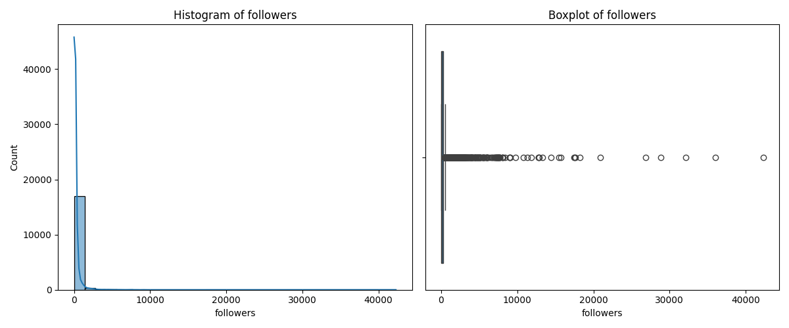
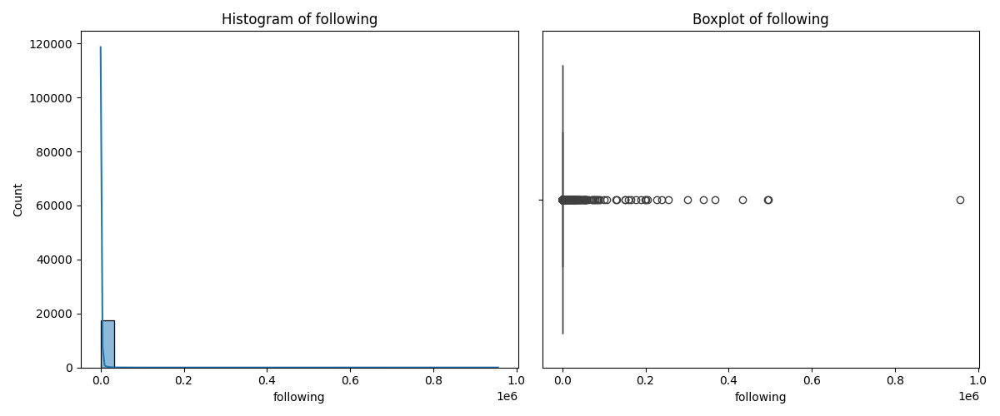
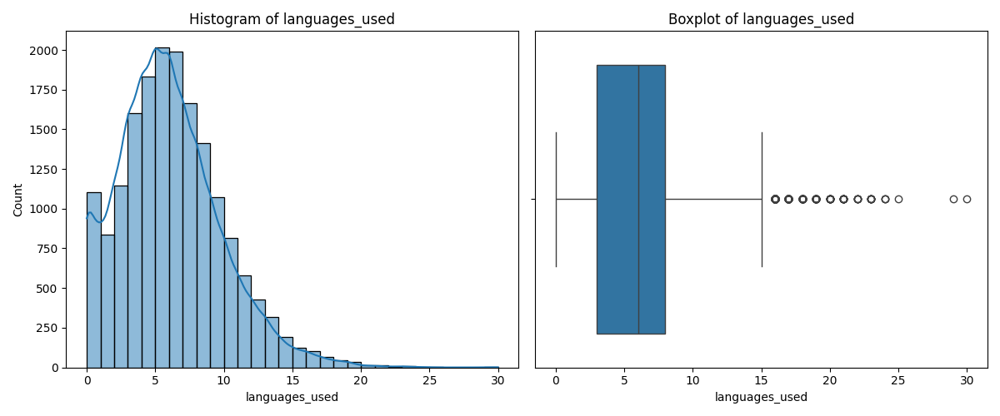
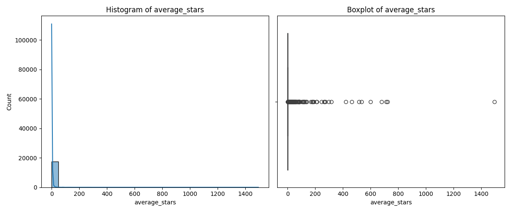
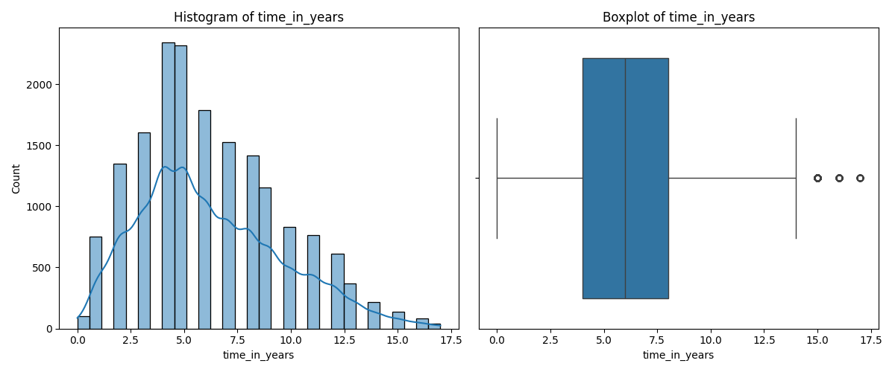
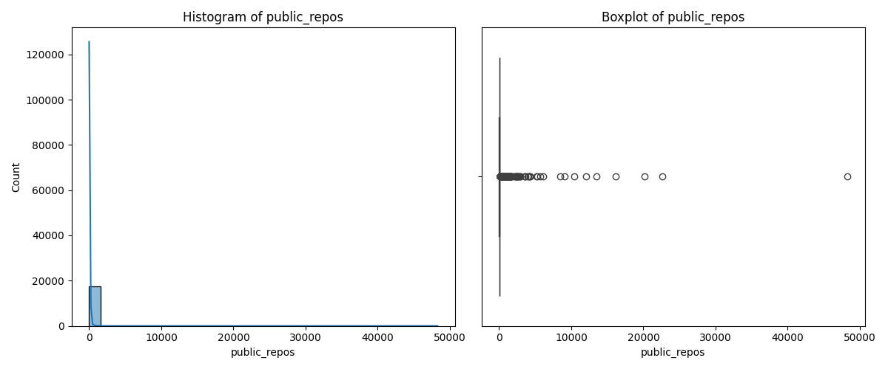
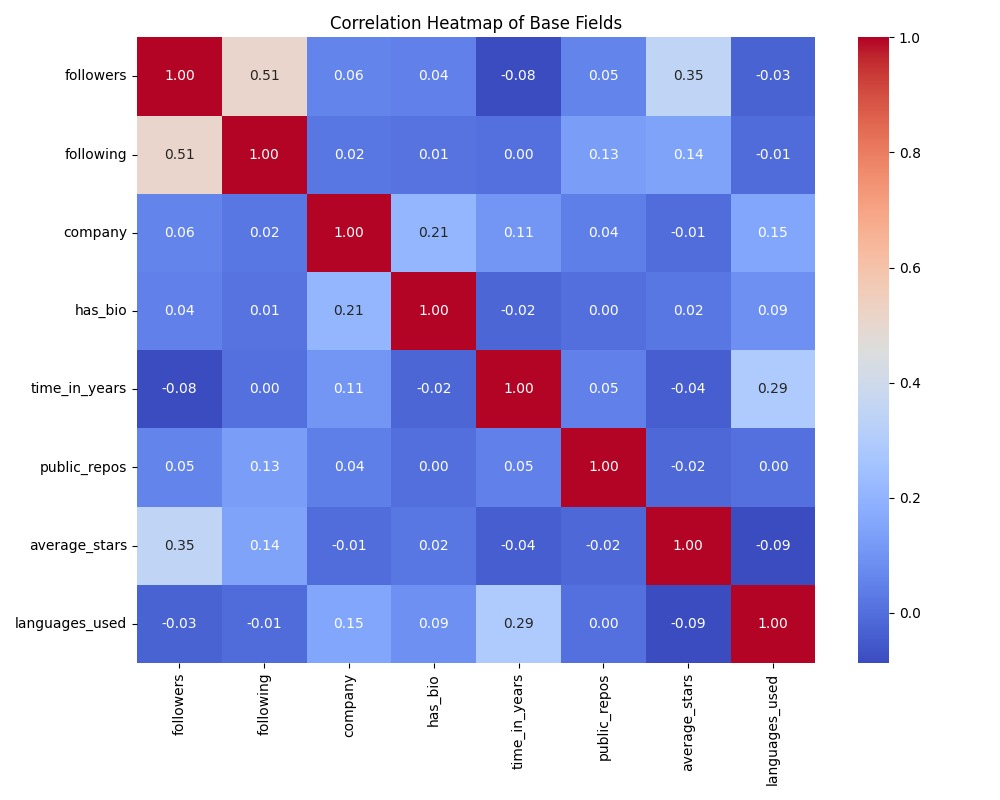
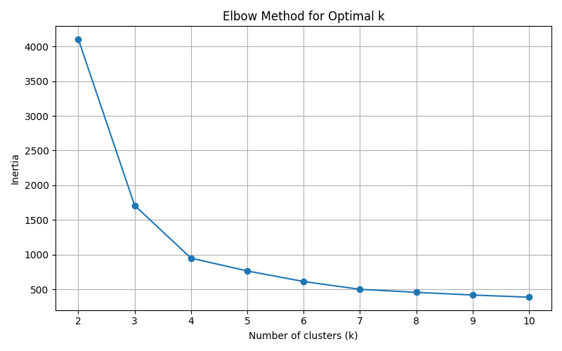
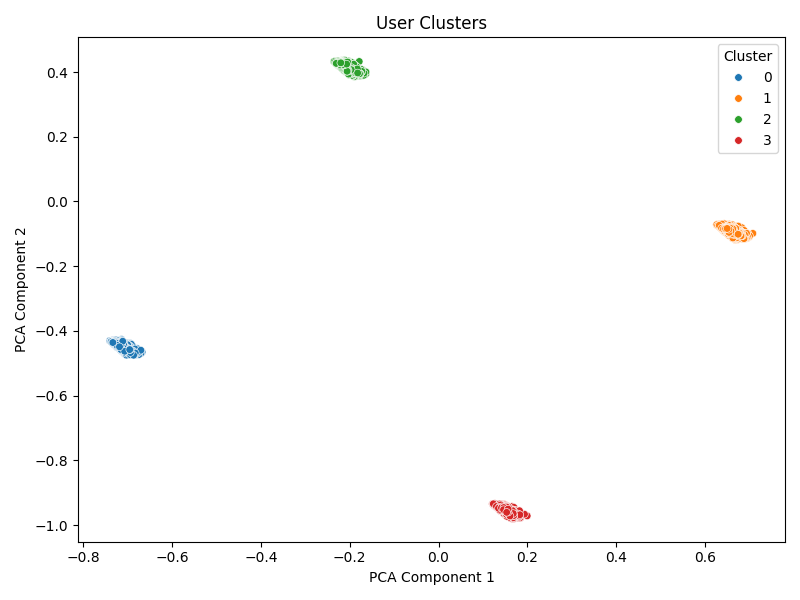

# Descoberta de Conhecimento: GitHub

```python
SEMESTRE  =  "2025/1"
DISCIPLINA  =  "Mineração e Análise de Redes Sociais"
ESTUDANTES  = ["Gabriel de Paula", "Wasterman Apolinário"]
PROFESSOR  =  "Vinicius Vieira"
```

## 1. Introdução

Essa atividade tem como foco principal praticar a metodologia de Descoberta de Conhecimento em Bases de Dados (KDD - Knowledge Discovery in Databases). É necessário, portanto, seguir bem os passos do processo: coletar dados, estruturar a base, aplicar técnicas e refletir sobre os resultados. Ou seja, o objetivo é entender como cada etapa funciona na prática, experimentando o uso das técnicas vistas em sala.

Para isso foi escolhido o GitHub como rede social real, já utilizado nas outras etapas da disciplina, e, a partir disso, houve a criação de uma base estruturada com atributos bem definidos. O foco foi transformar os dados brutos em algo organizado, que permitisse a aplicação das etapas do KDD.

## 2. Construção da base de dados

Para a construção da base de dados, por se tratar de uma rede social voltada para desenvolvedores, é possível relacionar usuários não apenas por se seguirem, mas considerando também aspectos dos repositórios de cada um. O foco foi extrair dados relacionados aos usuários e seus relacionamentos dentro da plataforma, de modo a representar a rede de conexões e a atividade colaborativa presente ali.

### 2.1. Atributos selecionados

Alguns dados são particularmente interessantes para estabelecer conexões e identificar padrões de comportamento entre diferentes usuários, pois permitem compreender como determinados perfis se relacionam, compartilham interesses ou apresentam trajetórias semelhantes dentro de um sistema.

| Dado coletado                       | Tipo      |
|-------------------------------------|-----------|
| ___Nome do usuário___               | String    |
| Quantidade de seguidores            | Número    |
| Quantidade de "seguindo"            | Número    |
| Quantidade de repositórios públicos | Número    |
| Nome da Empresa                     | String    |
| Linguagens mais utilizadas          | String [] |
| Quantidade média de estrelas        | Número    |
| Data de entrada na plataforma       | String    |

&nbsp;

### 2.2. Tratamentos nos dados

Para possibilitar associações mais precisas entre os usuários, foi necessário realizar um tratamento prévio dos dados. Esse processo envolveu a padronização de formatos e a remoção de duplicidades, garantindo maior integridade e confiabilidade dos registros. Além disso, a transformação de certos atributos em categorias mais significativas facilitou a identificação de padrões e a comparação entre perfis distintos.

| Dado coletado                       | Tipo      |
|-------------------------------------|-----------|
| ___Nome do usuário___               | String    |
| Quantidade de seguidores            | Número    |
| Quantidade de "seguindo"            | Número    |
| Quantidade de repositórios públicos | Número    |
| Está em uma empresa                 | Booleano  |
| Linguagens mais utilizadas          | { nome: String, quantidade: Número} [] |
| Quantidade média de estrelas        | Número    |
| Tempo de plataforma (anos)          | Número    |

Com os dados devidamente tratados, tornou-se possível aplicar técnicas de análise mais eficazes, permitindo relações mais robustas e representativas entre os usuários.

&nbsp;

## 3. Análise e Resultados

| Atributo       | Min   | Max       | Média   | Mediana | Desvio-padrão |
|----------------|-------|-----------|---------|---------|---------------|
| followers      | 0  | 42289  | 793.47  | 278  | 1876.69       |
| following      | 0  | 955916 | 4295.90 | 411.50  | 30503.73      |
| company        | 0  | 1      | 0.44    | 0    | 0.50          |
| has_bio        | 0  | 1      | 0.80    | 1    | 0.40          |
| time_in_years  | 0  | 17     | 6.31    | 6    | 3.79          |
| public_repos   | 0  | 48307  | 116.49  | 31   | 1222.68       |
| average_stars  | 0  | 297.14    | 3.61    | 1.10    | 11.68         |
| languages_used | 0  | 23     | 6.35    | 6    | 3.92          |








Ao observar os histogramas e boxplots gerados para os atributos selecionados (como número de seguidores, número de repositórios públicos, tempo de conta, entre outros), é possível concluir que a maioria desses atributos não apresenta uma distribuição uniforme. Isso significa que os valores não estão igualmente distribuídos ao longo de todo o intervalo possível.

Além da análise individual das distribuições, também foi realizada uma análise de correlação entre os atributos numéricos, utilizando um heatmap de correlações baseado na correlação de Pearson.



Essa análise nos ajuda a entender quais atributos possuem relação linear entre si, o que pode indicar dependência entre as variáveis ou mesmo redundância de informação.

Principais correlações observadas:
- Followers vs Following (0.51):
Existe uma correlação moderada entre o número de seguidores que um usuário possui e o número de pessoas que ele segue. Isso sugere que usuários mais ativos em seguir outras contas tendem também a ter mais seguidores, o que é um comportamento comum em redes sociais.

- Tempo de Uso no GitHub vs Número de Linguagens Usadas (0.29):
Usuários com mais tempo de conta no GitHub tendem a ter usado uma maior diversidade de linguagens de programação, o que é esperado, dado o maior tempo de experiência.

- Followers vs Average Stars (0.35):
Há uma correlação moderada entre o número de seguidores e a média de estrelas recebidas nos repositórios. Isso indica que usuários mais populares (com mais seguidores) também tendem a criar projetos mais bem avaliados pela comunidade.

- Has Bio vs Has Company (0.21):
Existe uma correlação fraca entre o fato de o usuário ter preenchido a biografia e também ter informado a empresa em que trabalha. Isso sugere que usuários mais preocupados com o perfil público tendem a preencher mais informações.

De forma geral, não foram observadas correlações muito altas (acima de 0.6) entre os atributos, o que indica que os atributos são relativamente independentes entre si, o que é bom para o processo de clustering, pois significa que cada variável está provavelmente adicionando uma informação única ao modelo.

Os poucos casos de correlação moderada fazem sentido com o contexto social e técnico da plataforma GitHub.

&nbsp;

## 5. Clustering
A técnica escolhida para análise foi o clustering, mais especificamente o algoritmo K-Means, por se tratar de um dataset não rotulado.

O K-Means funciona dividindo os dados em K grupos, onde os pontos dentro de um mesmo grupo devem ser o mais semelhantes entre si possível, enquanto se mantenham distintos de pontos de outros grupos. Essa semelhança pe calculada utilizando distância em um espaço multidimensional dado pelos atributos selecionados.

### 5.1. Escolha do número de clusters
Para definir o número ideal de clusters, aplicamos o método do Elbow Method, que consiste em:

- Rodar o K-Means com diferentes valores de K (por exemplo, de 1 até 10).
- Plotar a curva de inércia (soma das distâncias quadradas internas a cada cluster) versus o número de clusters.



Foi selecionado o valor de 4 Clusters para a análise, de acordo com o método Elbow.

### 5.2. Estratégias para Reduzir Overfitting:
Embora o K-Means seja um método não supervisionado, algumas práticas foram adotadas para evitar overfitting a ruídos nos dados:

- Normalização dos atributos antes da clusterização (usando Min-Max Scaling entre 0 e 1), para que nenhuma variável tivesse peso excessivo devido à escala.

- Exclusão de atributos irrelevantes (como localização textual).

### 5.3. Visualização
Como o dataset possuía muitas variáveis numéricas (como número de seguidores, repositórios, média de estrelas, etc.), utilizamos PCA (Principal Component Analysis) para reduzir a dimensionalidade antes da visualização dos clusters.



É possível observar que os clusters ficaram distantes um dos outros em termos dos componentes PCA, o que é um bom indicativo da eficácia do algoritmo.

Foi atingido também um valor de Silhouette de aproximadamente 0.7, o que pode ser considerado satisfatório, dado a natureza da rede.

&nbsp;

&nbsp;

### 5.4. Relacionando a rede
Após a execução do algoritmo de clustering, foi utilizada a rede de seguidores mútuos (arquivo GraphML com o grafo social GitHub), para avaliar a densidade de conexões intra-cluster, ou seja, em média, quantos usuários se seguiam dentro do mesmo clusters, comparado a densidade média do grafo.

| Cluster | Número de Arestas Internas | Número Máximo Possível de Arestas | Densidade Interna | Densidade Relativa |
|---------|---------------------------|-----------------------------------|-------------------|--------------------|
| 0       | 3,513                     | 5,952,975                         | 0.000590          | 6.41x              |
| 1       | 23,849                    | 17,266,626                        | 0.001381          | 15.00x             |
| 2       | 25,506                    | 25,336,521                        | 0.001007          | 10.93x             |
| 3       | 437                       | 465,130                           | 0.000940          | 10.20x             |

O resultado foi que todos os clusters apresentaram uma densidade de conexões significativamente maior (6x a 14x) do que o grafo geral, indicando que usuários com perfis similares (pelo clustering) tendem a se seguir mais frequentemente.


## 6. Discussão

A atividade permitiu aplicar, na prática, os conceitos da metodologia de KDD, desde a coleta até a análise de dados. Foi possível montar uma base estruturada que representasse os usuários e suas relações dentro da rede, com atributos que refletem o comportamento individual e coletivo. Mesmo com algumas limitações na coleta (como restrições de acesso a dados mais profundos via API), foi possível construir um conjunto consistente e aplicar algumas técnicas de pré-processamento, organização e análise exploratória.

Mais do que os resultados em si, o valor da atividade esteve na experiência de seguir o processo completo, tomar decisões sobre o que incluir na base, lidar com dados reais e entender o impacto dessas escolhas na qualidade da análise. Foi um exercício importante para perceber que a descoberta de conhecimento começa muito antes dos algoritmos e que a forma como os dados são estruturados tem impacto direto no que será possível descobrir depois.
