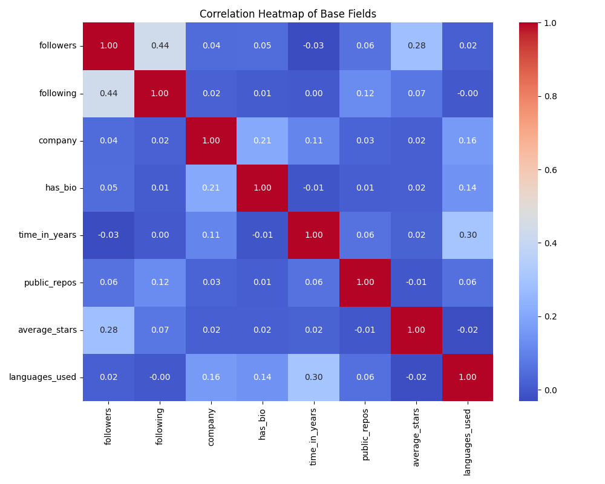

# Descoberta de Conhecimento: GitHub

```python
SEMESTRE  =  "2025/1"
DISCIPLINA  =  "Mineração e Análise de Redes Sociais"
ESTUDANTES  = ["Gabriel de Paula", "Wasterman Apolinário"]
PROFESSOR  =  "Vinicius Vieira"
```

&nbsp;

## 1. Introdução

Essa atividade tem como foco principal praticar a metodologia de Descoberta de Conhecimento em Bases de Dados (KDD - Knowledge Discovery in Databases). É necessário, portanto, seguir bem os passos do processo: coletar dados, estruturar a base, aplicar técnicas e refletir sobre os resultados. Ou seja, o objetivo é entender como cada etapa funciona na prática, experimentando o uso das técnicas vistas em sala.

Para isso foi escolhido o GitHub como rede social real, já utilizado nas outras etapas da disciplina, e, a partir disso, houve a criação de uma base estruturada com atributos bem definidos. O foco foi transformar os dados brutos em algo organizado, que permitisse a aplicação das etapas do KDD.

## 2. Construção da base de dados

Para a construção da base de dados, por se tratar de uma rede social voltada para desenvolvedores, é possível relacionar usuários não apenas por se seguirem, mas considerando também aspectos dos repositórios de cada um. O foco foi extrair dados relacionados aos usuários e seus relacionamentos dentro da plataforma, de modo a representar a rede de conexões e a atividade colaborativa presente ali.

### 2.1. Atributos selecionados

Alguns dados são particularmente interessantes para estabelecer conexões e identificar padrões de comportamento entre diferentes usuários, pois permitem compreender como determinados perfis se relacionam, compartilham interesses ou apresentam trajetórias semelhantes dentro de um sistema.

| Dado coletado                       | Tipo      |
|-------------------------------------|-----------|
| ___Nome do usuário___               | String    |
| Quantidade de seguidores            | Número    |
| Quantidade de "seguindo"            | Número    |
| Quantidade de repositórios públicos | Número    |
| Nome da Empresa                     | String    |
| Linguagens mais utilizadas          | String [] |
| Quantidade média de estrelas        | Número    |
| Data de entrada na plataforma       | String    |

&nbsp;

### 2.2. Tratamentos nos dados

Para possibilitar associações mais precisas entre os usuários, foi necessário realizar um tratamento prévio dos dados. Esse processo envolveu a padronização de formatos e a remoção de duplicidades, garantindo maior integridade e confiabilidade dos registros. Além disso, a transformação de certos atributos em categorias mais significativas facilitou a identificação de padrões e a comparação entre perfis distintos.

| Dado coletado                       | Tipo      |
|-------------------------------------|-----------|
| ___Nome do usuário___               | String    |
| Quantidade de seguidores            | Número    |
| Quantidade de "seguindo"            | Número    |
| Quantidade de repositórios públicos | Número    |
| Está em uma empresa                 | Booleano  |
| Linguagens mais utilizadas          | { nome: String, quantidade: Número} [] |
| Quantidade média de estrelas        | Número    |
| Tempo de plataforma (anos)          | Número    |

Com os dados devidamente tratados, tornou-se possível aplicar técnicas de análise mais eficazes, permitindo relações mais robustas e representativas entre os usuários.

&nbsp;

## 3. Análise e Resultados

| Atributo       | Min   | Max       | Média   | Mediana | Desvio-padrão |
|----------------|-------|-----------|---------|---------|---------------|
| followers      | 0  | 42289  | 793.47  | 278  | 1876.69       |
| following      | 0  | 955916 | 4295.90 | 411.50  | 30503.73      |
| company        | 0  | 1      | 0.44    | 0    | 0.50          |
| has_bio        | 0  | 1      | 0.80    | 1    | 0.40          |
| time_in_years  | 0  | 17     | 6.31    | 6    | 3.79          |
| public_repos   | 0  | 48307  | 116.49  | 31   | 1222.68       |
| average_stars  | 0  | 297.14    | 3.61    | 1.10    | 11.68         |
| languages_used | 0  | 23     | 6.35    | 6    | 3.92          |




&nbsp;

## 4. Discussão

A atividade permitiu aplicar, na prática, os conceitos da metodologia de KDD, desde a coleta até a análise de dados. Foi possível montar uma base estruturada que representasse os usuários e suas relações dentro da rede, com atributos que refletem o comportamento individual e coletivo. Mesmo com algumas limitações na coleta (como restrições de acesso a dados mais profundos via API), foi possível construir um conjunto consistente e aplicar algumas técnicas de pré-processamento, organização e análise exploratória.

Mais do que os resultados em si, o valor da atividade esteve na experiência de seguir o processo completo, tomar decisões sobre o que incluir na base, lidar com dados reais e entender o impacto dessas escolhas na qualidade da análise. Foi um exercício importante para perceber que a descoberta de conhecimento começa muito antes dos algoritmos e que a forma como os dados são estruturados tem impacto direto no que será possível descobrir depois.
